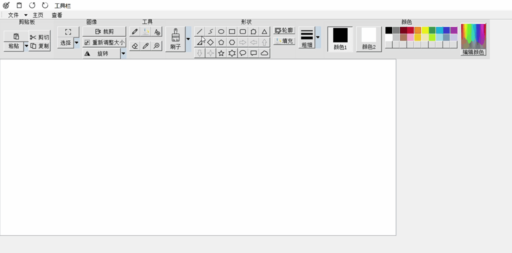
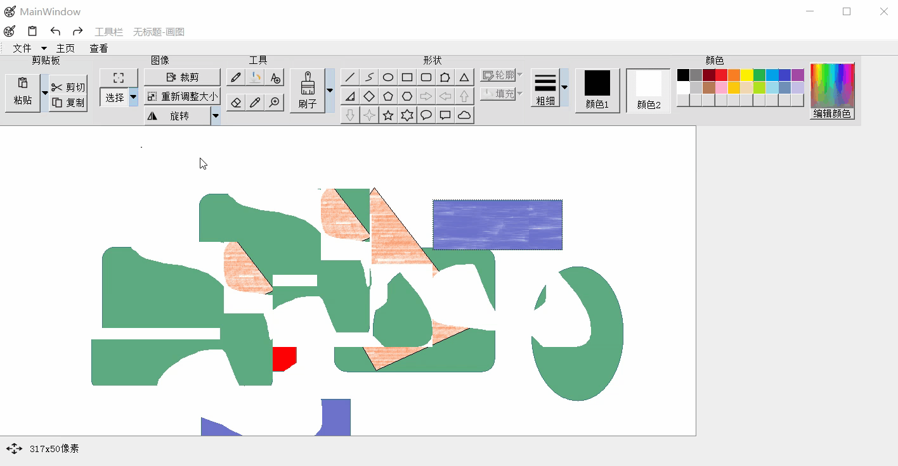
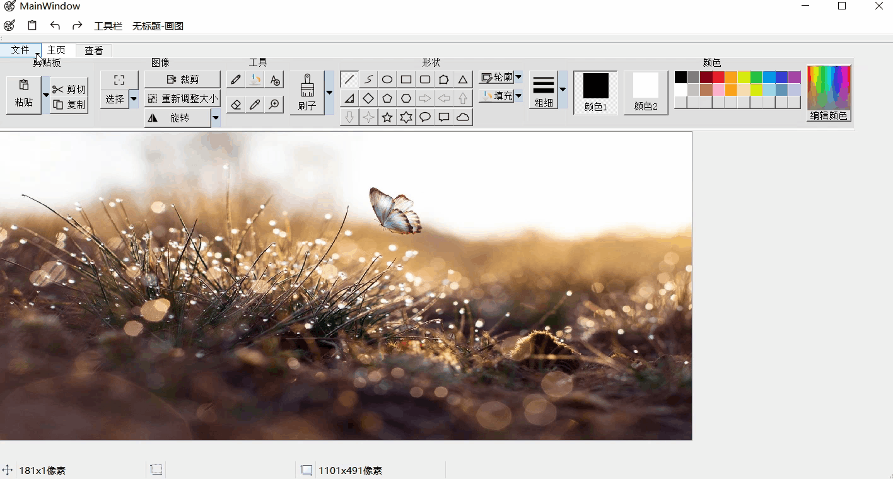

# Paint_Qt
It's a Qt implementation version of windows painter, which is also my big homework for getting
started with Qt/C++.

## Realized Functions
### all kinds of shapes

### all kinds of brushes

### eraser

### fill color

### undo and redo

### add texts

### select

### clip, copy, paste and crop

### all kings of colors

### dropper

### rotate

### magnifer

### resize

### rule

### status bar

### open and save

### print2pdf

### email

### property

### thumbnail

